## BDP (25000 bytes) < queue_size (50000)
- ./run.sh --cca my_cca --size-gib 1 --rtt-ms 0.4 --rate-mbit 1000 --tbf-rate 500Mbit --tbf-burst 50000b  --tbf-limit 50000b  --cwnd 50
- client_server/DB/1GB/1GB_48896_50 (**18.23s**)
- Comparison:
  - theoretical: (25000 + 50000 - 1460) / 1460 ~= 50
  - emperical: 33 ~ 34
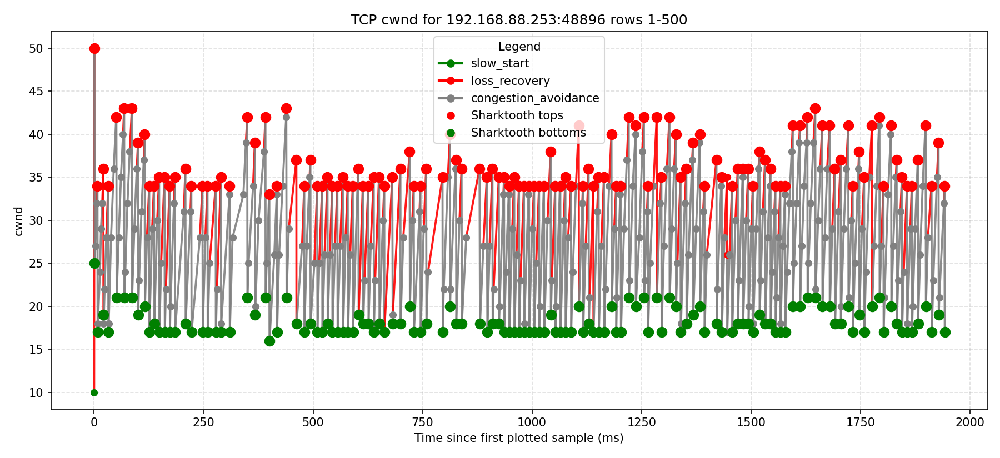


## BDP (25000 bytes) == queue_size (25000)
- ./run.sh --cca my_cca --size-gib 1 --rtt-ms 0.4 --rate-mbit 1000 --tbf-rate 500Mbit --tbf-burst 50000b  --tbf-limit 25000b  --cwnd 33
- client_server/DB/1GB/1GB_44934_33 (**18.27s**)
- Comparison:
  - theoretical: (25000 + 25000 - 1460) / 1460 ~= 33
  - emperical: 16 ~ 17.5
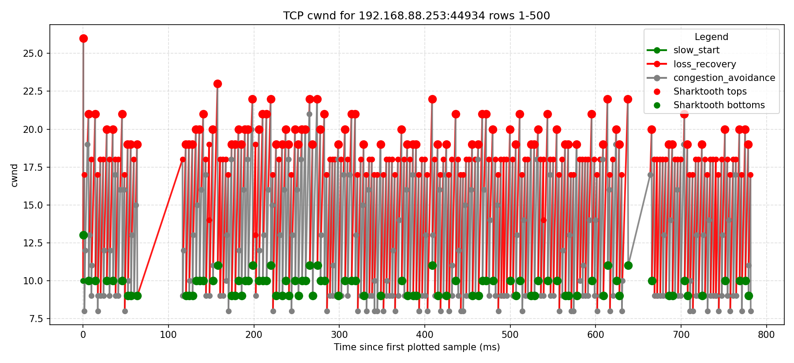


When we did with {rtt-ms: 0.4}, {TBF Rate: 1Gb}, {TBF Burst: 1Mb}, {TBF limit: 50000}, {MSS: 1460}, the optimal window size worked. changing the burst size to see what happens here we make it from 50,000b => 1Mb (1,000,000b) so 20 times more

- ./run.sh --cca my_cca --size-gib 1 --rtt-ms 0.4 --rate-mbit 1000 --tbf-rate 500Mbit --tbf-burst 1Mb  --tbf-limit 25000b  --cwnd 33
-  client_server/DB/1GB/1GB_41714_33 (**17.94s**)
- Comparison:
  - theoretical: (25000 + 25000 - 1460) / 1460 ~= 33
  - emperical: 20
- Note here, as it can be seen from the graph, for the first several ms, we were staying at tbe theoretical optimal window size 33


Maybe the token generation rate also matters? Running another test with the initial setup: **{rtt-ms: 0.4}, {TBF Rate: 1Gb}, {TBF Burst: 1Mb}, {TBF limit: 50000}, {MSS: 1460}** again.

Using the normal TCP Reno we get:
- ./run.sh --cca my_cca --size-gib 1 --rtt-ms 0.4 --rate-mbit 1000 --tbf-rate 1000Mbit --tbf-burst 1Mb  --tbf-limit 50000b  --cwnd 0
- client_server/DB/1GB/1GB_47786_0 (**9.69s**)
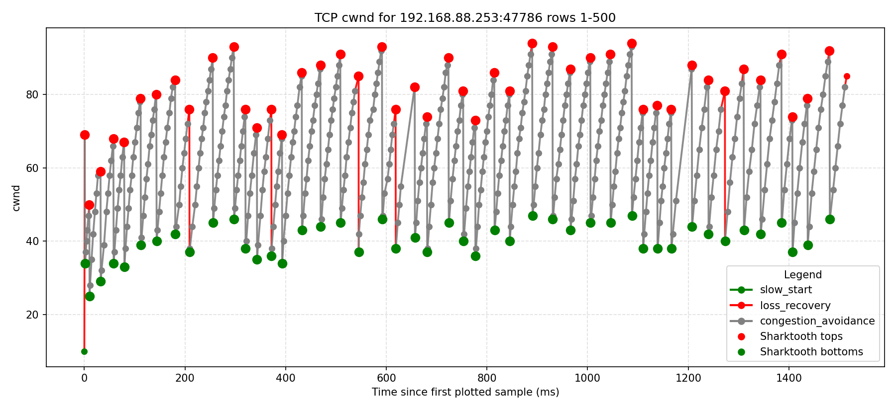

Using the optimal cwnd we get:
- ./run.sh --cca my_cca --size-gib 1 --rtt-ms 0.4 --rate-mbit 1000 --tbf-rate 1000Mbit --tbf-burst 1Mb  --tbf-limit 50000b  --cwnd 67
- Comparison:
  - theoretical: (50000 + 50000 - 1460) / 1460 ~= 67
  - emperical: 66~67
- client_server/DB/1GB/1GB_50912_67 (**9.27s**)


It seems like the optimal cwnd is "more optimal" under the case that token-generation rate is 1Gbit. We also want to check whether changing the burstSize back to 50000b will cause any difference.

Using the normal TCP Reno we get:
- ./run.sh --cca my_cca --size-gib 1 --rtt-ms 0.4 --rate-mbit 1000 --tbf-rate 1000Mbit --tbf-burst 50000b  --tbf-limit 50000b  --cwnd 0
- client_server/DB/1GB/1GB_38042_0 (**9.30s**)
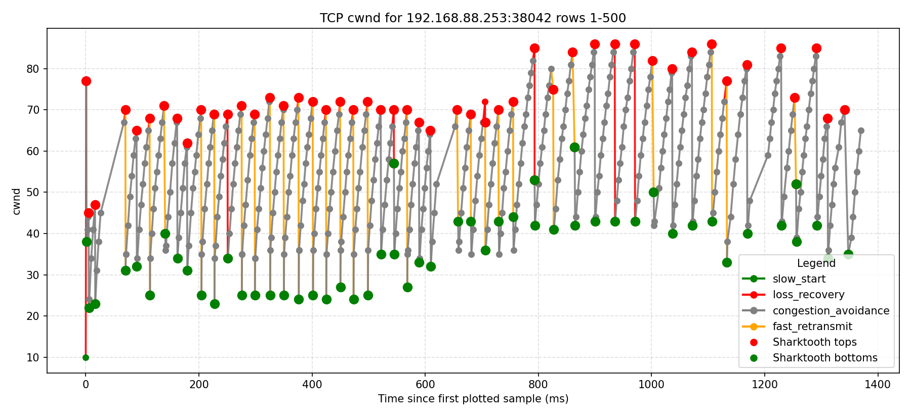


Using the optimal cwnd we get:
- ./run.sh --cca my_cca --size-gib 1 --rtt-ms 0.4 --rate-mbit 1000 --tbf-rate 1000Mbit --tbf-burst 50000b  --tbf-limit 50000b  --cwnd 67
- Comparison:
  - theoretical: (50000 + 50000 - 1460) / 1460 ~= 67
  - emperical: 64~67???
- client_server/DB/1GB/1GB_42250_67 (**9.40s**)


Yes, even when the burst size is set to 50000 bytes, the "optimal window" size seems to be still optimal. Meaning that, the token generate rate indeed matters. But HOW DOES THIS EFFECT THE optimal cwnd equation?


Here I let CODEX analysed the tested result above, and it gave me a reason: **"burst penality was not taken into account"**. Essentially, the current pipeline looks like this: TCP Application -> qdisc/TBF queue -> NIC driver -> physical link. And if the token-generation rate < packet arrival rate to the TBF queue, then logically thinking, the queue will be filled up. And the remaining queue size is the <ins>size that the CWND is still able to increase</ins>, we call this the **effective queue size**, which is the actual size that has to be taken into account when calculting the optimal window size.

Based on this idea, we redefine the optial window equation as:
```bash
R_arrival = effective packet arrival/enqueue rate into TBF
R_tbf  = token generation rate
BDP = R_tbf * RTT_base

# queue space consumed by the rate mismatch during one RTT
# burst_penalty = (R_arrival - R_tbf) * RTT
#               = R_arrival * RTT - R_tbf * RTT
#               = R_tbf * RTT * (R_arrival/R_tbf - 1)
#               = BDP * (R_arrival/R_tbf - 1)
burst_penalty = BDP * (R_arrival / R_tbf - 1)
Q_effective = max(0, Q_config - burst_penalty)
optimal_cwnd = floor((BDP + Q_effective - MSS) / MSS)
```

Using this equation to explain the case above we then get:
-  --tbf-rate 500Mbit --tbf-burst 50000b  --tbf-limit 50000b 
  - R_arrival: 1000Mbit
  - R_tbf = 500Mbit
  - RTT   = 0.4ms
  - BDP   = 500Mbit * 0.4ms = 25000B
  - burst_penalty = 25000 * (1000/500 - 1) = 25000B
  - Q_effective = 50000 - 25000 = 25000B
  - <ins>cwnd = (BDP + Q_effective - MSS) / MSS = (25000 + 25000 - 1460) / 1460 ~= 33 </ins>

- --tbf-rate 500Mbit --tbf-burst 50000b  --tbf-limit 25000b
  - R_arrival: 1000Mbit
  - R_tbf = 500Mbit
  - RTT   = 0.4ms
  - BDP   = 500Mbit * 0.4ms = 25000B
  - burst_penalty = 25000 * (1000/500 - 1) = 25000B
  - Q_effective = 25000 - 25000 = 0B
  - <ins>cwnd = (BDP + Q_effective - MSS) / MSS = (25000 + 0 - 1460) / 1460 ~= 16 </ins>


- --tbf-rate 500Mbit --tbf-burst 1Mb --tbf-limit 25000b
  - R_arrival: 1000Mbit
  - R_tbf = 500Mbit
  - RTT   = 0.4ms
  - BDP   = 500Mbit * 0.4ms = 25000B
  - burst_penalty = 25000 * (1000/500 - 1) = 25000B
  - Q_effective = 25000 - 25000 = 0B
  - <ins>cwnd = (BDP + Q_effective - MSS) / MSS = (25000 + 0 - 1460) / 1460 ~= 16 </ins>
  - As stated before "Note here, as it can be seen from the graph, for the first several ms, we were staying at tbe theoretical optimal window size 33". This was because the actual theoretical cwnd was 16, but due to the 1MB burst size, it was able to temporary reach 33 cwnd

As it can be seen from the calculation above, when token-generation rate < R_arrival, the equation above always applies. When token-generation rate ~= R_arrival, the optimal cwnd equation will just be **BDP + queue - MSS**. This is the reason why when token generation rate was 1GB, we were able to find the optimal window size.


Note that to get the R_arrival, we need to kinda track the enqueue rate (TCP application -> qdisc). However, it is also possible to reverse calculate this by using the emperical cwnd. That is:
```bash 
(burst_penalty + BDP) / RTT = R_arrival  
burst_penalty = Q_config - Q_effective
optimal_cwnd = floor((BDP + Q_effective - MSS) / MSS)


# so when...
optimal_cwnd = 16
burst_penalty = 25000B
BDP = 25000B
RTT = 0.4ms
R_arrival = (25000B + 25000B) * 8 / 0.0004 = 1Gbit 
```

But what happens when **burst_penality > Q_effective**? In this case, <ins> the queue is so small that the sender cannot safely keep a full BDP in flight, because the TBF cannot absorb the burst mismatch.</ins> 

For instance when you have --tbf-rate 500Mbit --tbf-burst 50000b  --tbf-limit 6250, the burst penality is 25000B, but you only have 6250 bytes for the TBF queue, and it is not enough to contain the incoming accumulating packets due to the RTT. Most of the packets will overflow, and the sender cannot safely keep `BDP` bytes in flight. The optimal cwnd must be smaller than the BDP-based value, because part of the sending window must be sacrificed to avoid TBF drops caused by bursty enqueue behavior.

This explains the case 

In conclusion:
```
burst_penality = (R_arrival - R_tbf) * RTT

if burst_penalty <= Q_config:
    Q_effective = Q_config - burst_penalty
    cwnd = floor((BDP + Q_effective - MSS) / MSS)

if burst_penalty > Q_config:
    Q_effective = 0
    usable_bdp = BDP * min(1, Q_config / burst_penalty)
    cwnd = floor((usable_bdp + Q_effective - MSS) / MSS)
```

Below we will conduct more tests to see whether this equation truely works or not:

## burst_penalty <= Q_config
### Test 1
- ./run.sh --cca my_cca --size-gib 1 --rtt-ms 0.4 --rate-mbit 200 --tbf-rate 200Mbit --tbf-burst 50000b  --tbf-limit 50000b --cwnd 12
  - R_arrival: 1000Mbit
  - R_tbf = 200Mbit
  - RTT   = 0.4ms
  - BDP   = 200Mbit * 0.4ms = 10000B
  - burst_penalty = 10000 * (1000/200 - 1) = 40000B
  - Q_effective = 50000 - 40000 = 10000B
  - <ins>cwnd = (BDP + Q_effective - MSS) / MSS = (10000 + 10000 - 1460) / 1460 ~= 12.69 => 12 </ins>
- client_server/DB/1GB/1GB_35170_12 (**45.11s**)


Ok it seems like here 12 is not the optimal rate. 
- DB/1GB/1GB_43370_15 (**45.05s**)
- DB/1GB/1GB_44342_30 (**44.98s**)
- DB/1GB/1GB_47504_32 (**44.96s**)
- DB/1GB/1GB_34780_33 (**44.96s**)
- DB/1GB/1GB_40442_35 (**44.99s**)
- The optimal cwnd seems to be 32 ~ 33???

```
At lower TBF rates, elapsed time quickly reaches the TBF-limited throughput even with a smaller cwnd. Therefore, the empirical “optimal” depends on the objective. If we optimize only throughput, cwnd=15 already performs almost as well (1GiB * 8 / 200Mbit/s ~= 42.95s and its around 45s overall when cwnd >= 12). 

If we optimize for the largest cwnd before repeated loss recovery, the safe upper region is around cwnd=30~32, with cwnd=33 already borderline.
```

- with TCP Reno Default we get:
- client_server/DB/1GB/1GB_55714_0 (**44.95s**)
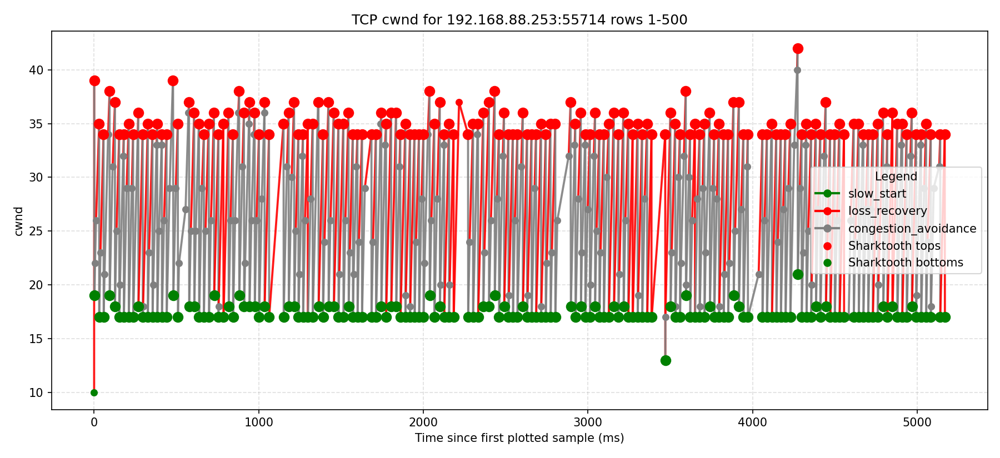

### Test 2 (750Mbit, 50000b queue)
- ./run.sh --cca my_cca --size-gib 1 --rtt-ms 0.4 --rate-mbit 750 --tbf-rate 750Mbit --tbf-burst 50000b  --tbf-limit 50000b --cwnd 57
  - R_arrival: 1000Mbit
  - R_tbf = 750Mbit
  - RTT   = 0.4ms
  - BDP   = 750Mbit * 0.4ms = 37500B
  - burst_penalty = 37500 * (1000/750 - 1) = 12500B
  - Q_effective = 50000 - 12500 = 47500B
  - <ins>cwnd = (BDP + Q_effective - MSS) / MSS = (37500 + 47500 - 1460) / 1460 ~= 57.22 => 57 </ins>
- client_server/DB/1GB/1GB_41662_57 (**12.07s**)
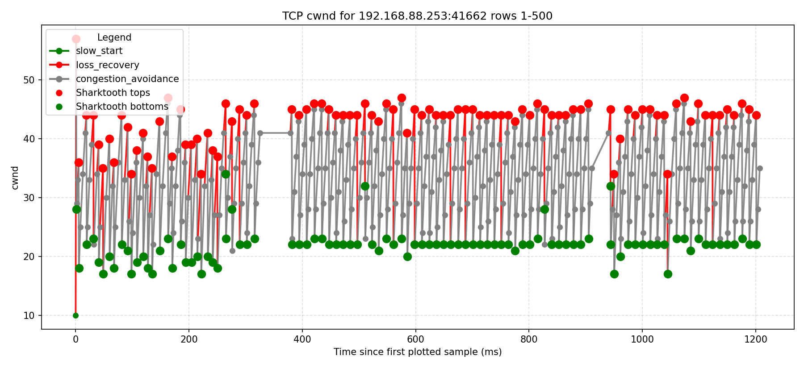


It seems like the optimal cwnd is around 36~43
- client_server/DB/1GB/1GB_47470_36 (**12.02**)
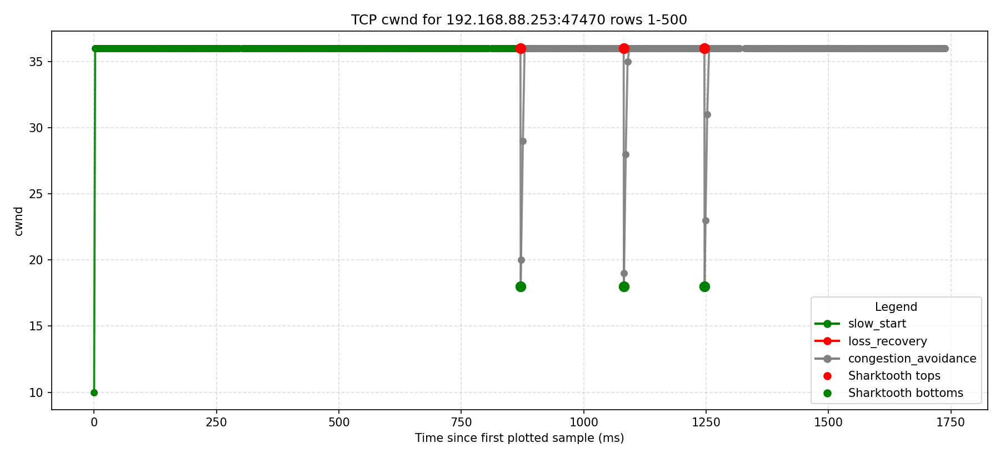
- client_server/DB/1GB/1GB_49228_37 (**12.07**)
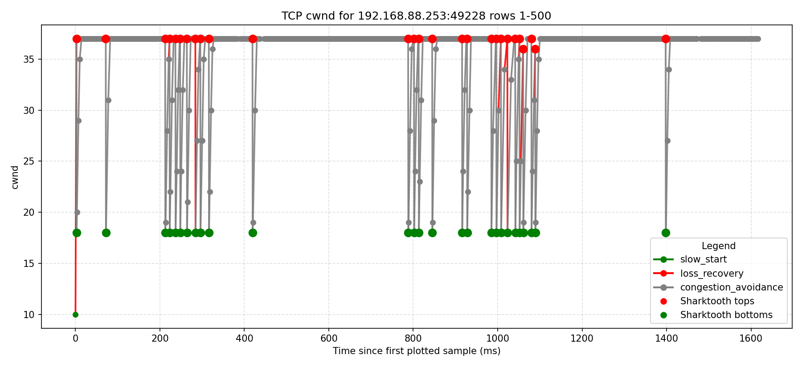
- client_server/DB/1GB/1GB_39108_38 (**12.03**)
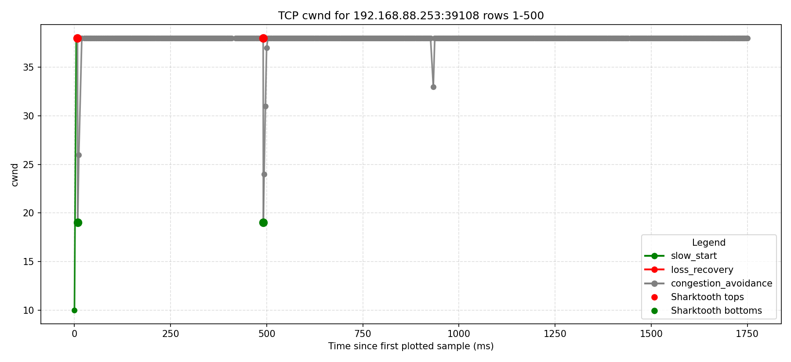
- client_server/DB/1GB/1GB_49024_39 (**12.07**)
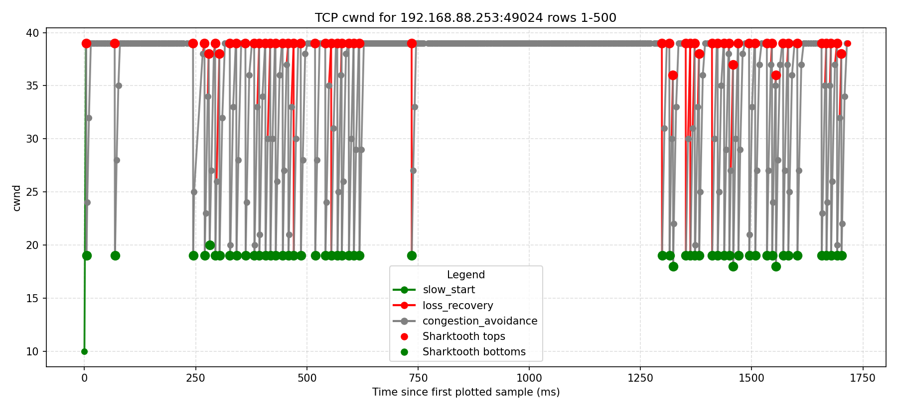
- client_server/DB/1GB/1GB_55568_40 (**12.04**)
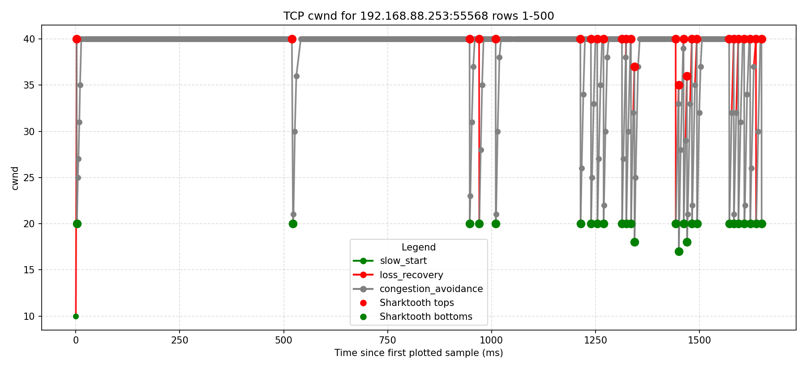
- DB/1GB/1GB_34342_42 (**12.18**)
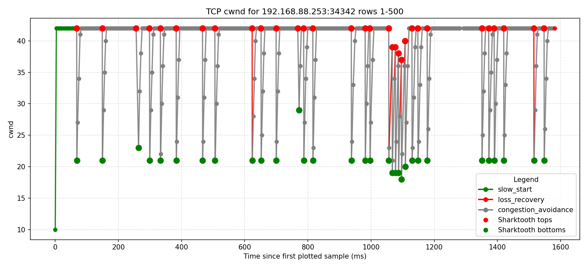

Using this to reverse calculate the R_arrival, we then get:
- optimal cwnd if == 36 
  - Q_effective = 36 * 1460 + 1460 - 37500 = 16520
  - burst_penalty = 50000 - 16520 = 33480
  - R_arrival = (33480 / 37500 + 1) * 750 = 1419.6 Mbit

- optimal cwnd if == 38 
  - Q_effective = 38 * 1460 + 1460 - 37500 = 19440
  - burst_penalty = 50000 - 19440 = 30560
  - R_arrival = (30560 / 37500 + 1) * 750 = 1361.2 Mbit

- optimal cwnd if == 40
  - Q_effective = 40 * 1460 + 1460 - 37500 = 22360
  - burst_penalty = 50000 - 22360 = 27640
  - R_arrival = (27640 / 37500 + 1) * 750 = 1302.4 Mbit

- optimal cwnd if == 42 
  - Q_effective = 42 * 1460 + 1460 - 37500 = 25280
  - burst_penalty = 50000 - 25280 = 24720
  - R_arrival = (24270 / 37500 + 1) * 750 = 1235.4 Mbit

I SUSPECT WE NEED TO MONITOR THE R_ARRIVAL IN REAL TIME IN ORDER TO CALCULATE THE OPTIAML CWND. Shouldn't keep using the assumption that R_arrival = 1Gbits/s. 
After adding r_arrival_extractor.py, we realized that this assumption was indeed correct. The r_arrival rate is not always the same. To solve this issue, I added a PACING RATE to the server.py, so TCP socket does not transfer packets faster than the pace to the qdisc.


### Test 3 (using the reverse calculated R_arrival rate to test 750Mbit, 25000b queue)
- with TCP Reno Default we get:
- client_server/DB/1GB/1GB_47064_0 (**12.16**)
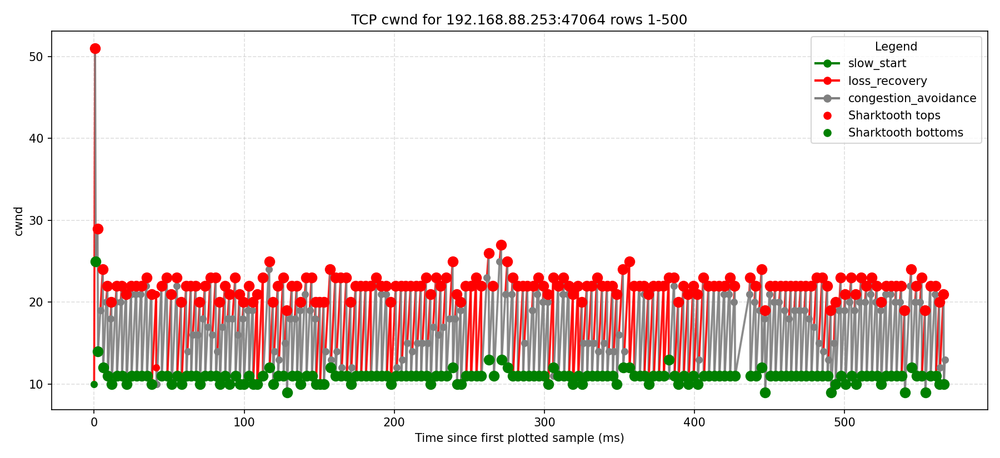


#### R_arrival = 1420 Mbit (THIS IS THE OPTIMAL)
- ./run.sh --cca my_cca --size-gib 1 --rtt-ms 0.4 --rate-mbit 750 --tbf-rate 750Mbit --tbf-burst 50000b  --tbf-limit 25000b --cwnd 18
  - R_arrival: 1420Mbit
  - R_tbf = 750Mbit
  - RTT   = 0.4ms
  - BDP   = 750Mbit * 0.4ms = 37500B
  - burst_penalty = 37500 * (1420/750 - 1) = 33500
  - Q_effective = 0
  - usable_bdp = 37500 * min(1, 25000 / 33500) = 27985
  - <ins>cwnd = (usable_bdp + Q_effective - MSS) / MSS = (27985 + 0 - 1460) / 1460 ~= 18.16 => 18 </ins>
- client_server/DB/1GB/1GB_55592_18 (**12.02**)
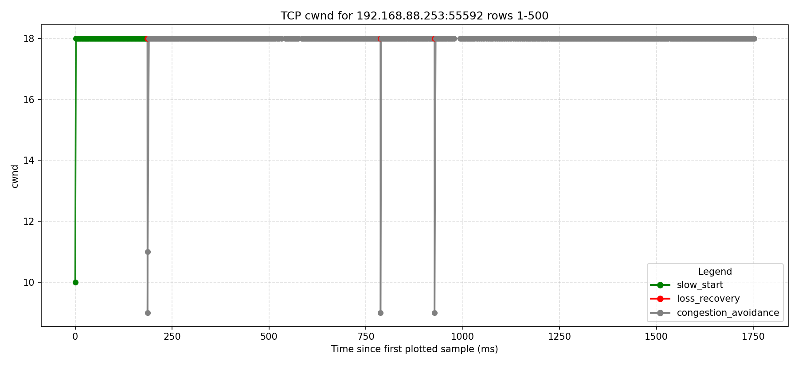


#### R_arrival = 1361 Mbit 
- ./run.sh --cca my_cca --size-gib 1 --rtt-ms 0.4 --rate-mbit 750 --tbf-rate 750Mbit --tbf-burst 50000b  --tbf-limit 25000b --cwnd 20
  - R_arrival: 1361Mbit
  - R_tbf = 750Mbit
  - RTT   = 0.4ms
  - BDP   = 750Mbit * 0.4ms = 37500B
  - burst_penalty = 37500 * (1361/750 - 1) = 30550B
  - Q_effective = 0
  - usable_bdp = 37500 * min(1, 25000 / 30550) = 30687
  - <ins>cwnd = (usable_bdp + Q_effective - MSS) / MSS = (30687 + 0 - 1460) / 1460 ~= 22.01 => 20 </ins>
- client_server/DB/1GB/1GB_42404_20 (**12.06**)
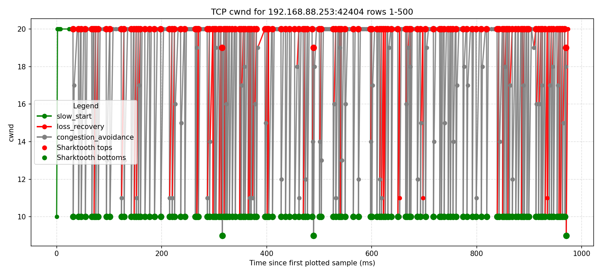


#### R_arrival = 1302 Mbit 
- ./run.sh --cca my_cca --size-gib 1 --rtt-ms 0.4 --rate-mbit 750 --tbf-rate 750Mbit --tbf-burst 50000b  --tbf-limit 25000b --cwnd 22
  - R_arrival: 1302Mbit
  - R_tbf = 750Mbit
  - RTT   = 0.4ms
  - BDP   = 750Mbit * 0.4ms = 37500B
  - burst_penalty = 37500 * (1302/750 - 1) = 27600B
  - Q_effective = 0
  - usable_bdp = 37500 * min(1, 25000 / 27600) = 33967
  - <ins>cwnd = (usable_bdp + Q_effective - MSS) / MSS = (33967 + 0 - 1460) / 1460 ~= 22.26 => 22 </ins>
- client_server/DB/1GB/1GB_55324_22 (**12.12**)
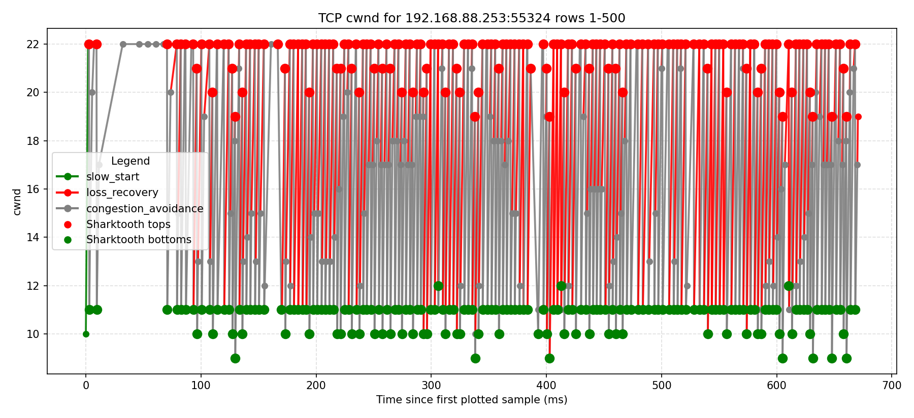

#### R_arrival = 1235 Mbit
- ./run.sh --cca my_cca --size-gib 1 --rtt-ms 0.4 --rate-mbit 750 --tbf-rate 750Mbit --tbf-burst 50000b  --tbf-limit 25000b --cwnd 25
  - R_arrival: 1235Mbit
  - R_tbf = 750Mbit
  - RTT   = 0.4ms
  - BDP   = 750Mbit * 0.4ms = 37500B
  - burst_penalty = 37500 * (1235/750 - 1) = 24250B
  - Q_effective = 25000 - 24250 = 750B
  - <ins>cwnd = (BDP + Q_effective - MSS) / MSS = (37500 + 750 - 1460) / 1460 ~= 25.19 => 25 </ins>
- client_server/DB/1GB/1GB_32982_25 (**12.13**)
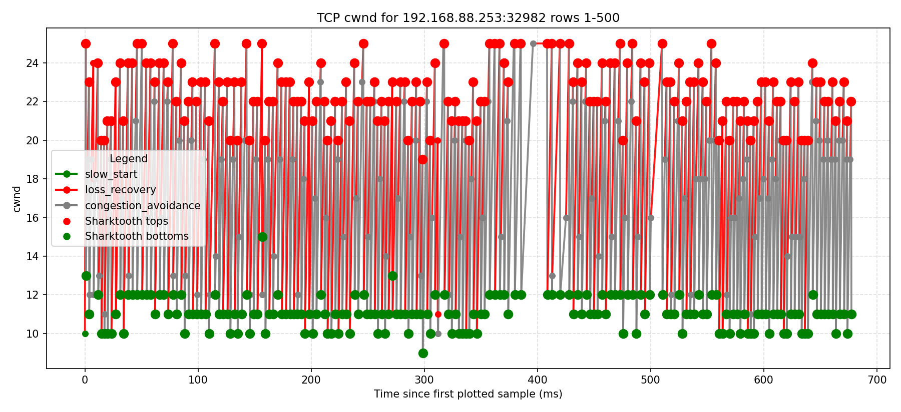


Seems like the theoretical optimal cwnd is 18 when **R_arrival = 1420 Mbit**. 
Using this t


### Test 4 (using the reverse calculated R_arrival rate to test 750Mbit, 12500b queue)
- with TCP Reno Default we get:
- client_server/DB/1GB/1GB_38038_0 (**14.56**)
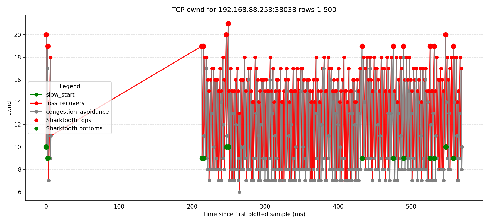


- ./run.sh --cca my_cca --size-gib 1 --rtt-ms 0.4 --rate-mbit 750 --tbf-rate 750Mbit --tbf-burst 50000b  --tbf-limit 12500b --cwnd 12
  - R_arrival: 1420Mbit
  - R_tbf = 750Mbit
  - RTT   = 0.4ms
  - BDP   = 750Mbit * 0.4ms = 37500B
  - burst_penalty = 37500 * (1420/750 - 1) = 24250B
  - Q_effective = 0
  - usable_bdp = 37500 * min(1, 12500 / 24250) = 19330
  - <ins>cwnd = (usable_bdp + Q_effective - MSS) / MSS = (19330 + 0 - 1460) / 1460 ~= 12.24 => 12 </ins>
- client_server/DB/1GB/1GB_33854_12 (**12.05**)
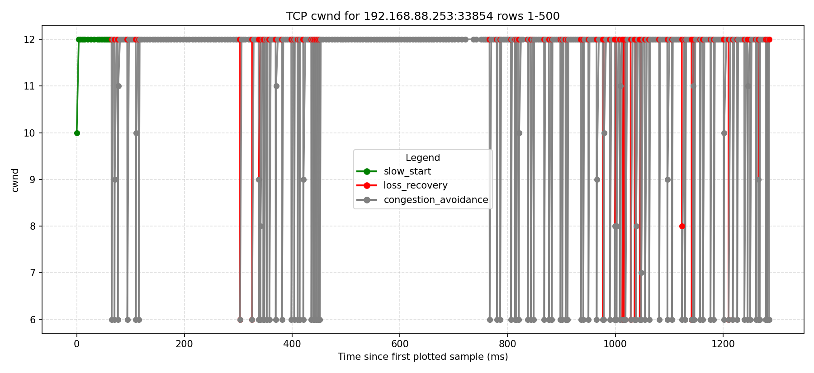

This seems optimal.


### Test 4 (using the reverse calculated R_arrival rate to test 750Mbit, 6250b queue)
- with TCP Reno Default we get:
- client_server/DB/1GB/1GB_44108_0 (**64.73**)
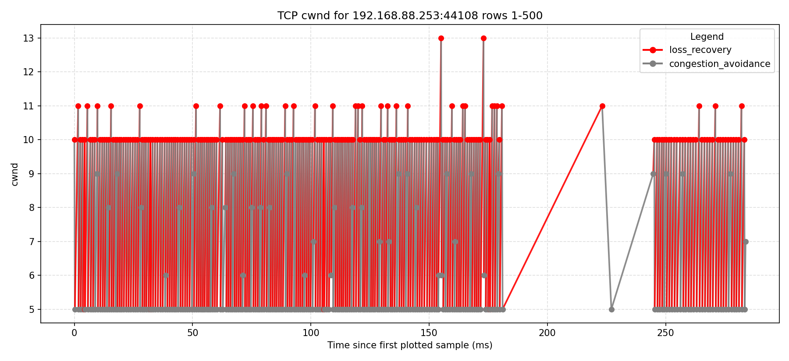

- ./run.sh --cca my_cca --size-gib 1 --rtt-ms 0.4 --rate-mbit 750 --tbf-rate 750Mbit --tbf-burst 50000b  --tbf-limit 6250b --cwnd 5
  - R_arrival: 1420Mbit
  - R_tbf = 750Mbit
  - RTT   = 0.4ms
  - BDP   = 750Mbit * 0.4ms = 37500B
  - burst_penalty = 37500 * (1420/750 - 1) = 24250B
  - Q_effective = 0
  - usable_bdp = 37500 * min(1, 6250 / 24250) = 9665
  - <ins>cwnd = (usable_bdp + Q_effective - MSS) / MSS = (9665 + 0 - 1460) / 1460 ~= 5.62 => 5 </ins>
- client_server/DB/1GB/1GB_60834_5 (**21.78**)
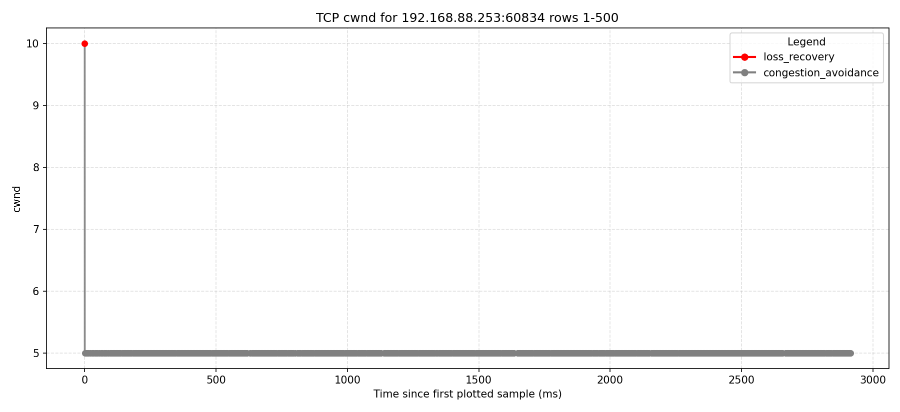 

This seems optimal.


### Test 5 (500Mbit, 50000b queue)
- with TCP Reno Default we get:


Finding the R_arrival:
- ./run.sh --cca my_cca --size-gib 1 --rtt-ms 0.4 --rate-mbit 500 --tbf-rate 500Mbit --tbf-burst 50000b  --tbf-limit 50000b --cwnd 
  - R_arrival: 1000Mbit
  - R_tbf = 500Mbit
  - RTT   = 0.4ms
  - BDP   = 500Mbit * 0.4ms = 
  - burst_penalty =  * (1000/500 - 1) = 
  - Q_effective = 0
  - Q_effective = 50000 -  = 
  - <ins>cwnd = (BDP + Q_effective - MSS) / MSS = ( +  - 1460) / 1460 ~=  =>  </ins>
- 
 


### Test 6 (500Mbit, 25000b queue)
- with TCP Reno Default we get:

### Test 7 (500Mbit, 12500b queue)
- with TCP Reno Default we get:

### Test 8 (500Mbit, 6250b queue)
- with TCP Reno Default we get:


### Test 9 (250Mbit, 50000b queue)
- with TCP Reno Default we get:

### Test 10 (250Mbit, 25000b queue)
- with TCP Reno Default we get:

### Test 11 (250Mbit, 12500b queue)
- with TCP Reno Default we get:

### Test 12 (250Mbit, 6250b queue)
- with TCP Reno Default we get:


## burst_penalty > Q_config
### Test 1
- ./run.sh --cca my_cca --size-gib 1 --rtt-ms 0.4 --rate-mbit 200 --tbf-rate 200Mbit --tbf-burst 50000b  --tbf-limit 25000b --cwnd 3
  - R_arrival: 1000Mbit
  - R_tbf = 200Mbit
  - RTT   = 0.4ms
  - BDP   = 200Mbit * 0.4ms = 10000B
  - burst_penalty = 10000 * (1000/200 - 1) = 40000B
  - usable_bdp = 10000 * min(1, 25000 / 40000)
  - <ins>cwnd = floor((usable_bdp + Q_effective - MSS) / MSS) = (6250 + 0 - 1460) / 1460 ~= 3.28 => 3 </ins>
- client_server/DB/1GB/1GB_54264_3 (**45.14s**)
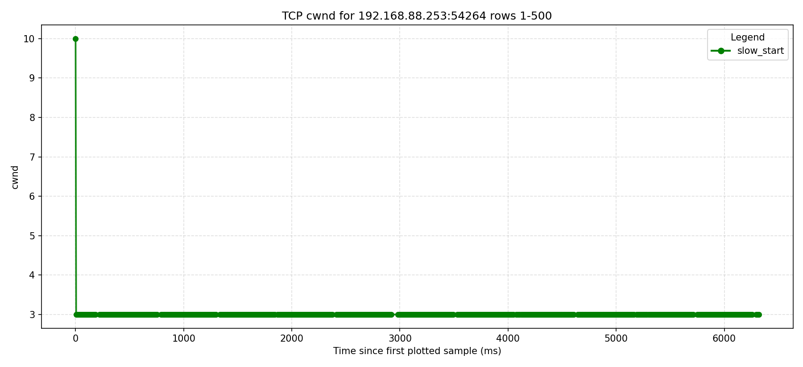

- with TCP Reno Default we get:
- client_server/DB/1GB/1GB_35434_0 (**45.06**)
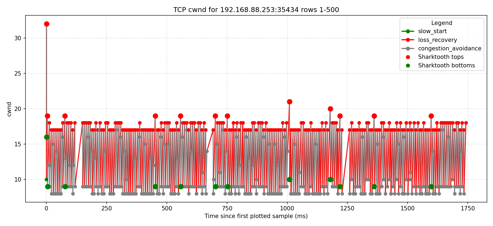


<ins>I feel like other than the case where Token-Gen-Rate == 1000Mbit and Token-Gen-Rate == 500Mbit, the equation proposed above to calculate the optimal cwnd does not really work.</ins> 