# Optimal CWND Experiments

## Goal

These experiments try to find a CWND cap for `my_cca` that keeps a TCP sender close to the TBF bottleneck rate while avoiding repeated TBF queue overflow and loss recovery.

The key path being studied is:

```text
TCP application -> qdisc / TBF queue -> NIC driver -> physical link
```

The main lesson from the experiments is that the original `BDP + queue` CWND estimate only works when the packet arrival rate into the TBF is close to the TBF token-generation rate. When the application enqueues into TBF faster than the bucket drains, part of the configured queue is already consumed by that mismatch. That consumed part should be treated as a burst penalty.

## Constants

| Item | Value |
| --- | --- |
| Transfer size | 1 GiB |
| Base RTT | 0.4 ms |
| MSS | 1460 B |
| Default TBF burst | 50000 B, except the explicit 1 MB burst check |
| Main CCA under test | `my_cca` |
| Baseline CCA | uncapped Reno behavior through `my_cca --cwnd 0` |

`R_arrival` in this note means a short-window enqueue-rate estimate into TBF. It is not the same as the whole-transfer `average_r_arrival_mbit` in `transfer_summary.json`, because the whole-transfer average tends to collapse toward the bottleneck rate.

## Model

The original model was:

```text
BDP = R_tbf * RTT_base
optimal_cwnd = floor((BDP + Q_config - MSS) / MSS)
```

That failed whenever `R_arrival > R_tbf`. The revised model is:

```text
BDP = R_tbf * RTT_base

Q_tbf = burst_penalty
      = max(0, (R_arrival - R_tbf) * RTT_base)
      = BDP * max(0, R_arrival / R_tbf - 1)

if Q_tbf <= Q_config:
    Q_effective = Q_config - Q_tbf
    cwnd = floor((BDP + Q_effective - MSS) / MSS)

if Q_tbf > Q_config:
    Q_effective = 0
    usable_bdp = BDP * min(1, Q_config / Q_tbf)
    cwnd = floor((usable_bdp - MSS) / MSS)
```

In the final table, `Q_tbf` is this burst penalty: the amount of TBF queue consumed during one RTT by the enqueue/drain-rate mismatch.

## Experiment Flow

1. Start with the simple BDP-plus-queue formula.
2. Observe that it overestimates CWND when `R_tbf` is 500 Mbit/s but the sender can enqueue closer to 1 Gbit/s.
3. Add `Q_tbf` / burst penalty to account for rate mismatch.
4. Use empirical CWND regions to reverse-estimate `R_arrival`.
5. Validate the revised formula across TBF rates of 750, 500, 250, and 200 Mbit/s with several queue sizes.

## Phase 1: Why BDP + Queue Was Not Enough

### 500 Mbit/s, 50000 B Queue

Command:

```bash
./run.sh --cca my_cca --size-gib 1 --rtt-ms 0.4 --rate-mbit 1000 --tbf-rate 500Mbit --tbf-burst 50000b --tbf-limit 50000b --cwnd 50
```

Result:

| Run | Elapsed | Finding |
| --- | ---: | --- |
| `DB/1GB/phase1/1GB_48896_50` | 18.23 s | Simple formula predicted CWND 50, but empirical optimum was closer to 33-34. |

Plot:


Interpretation: with a 500 Mbit/s TBF and roughly 1 Gbit/s arrival into TBF, about 25000 B of the configured 50000 B queue is consumed by the rate mismatch during one RTT. The effective queue is therefore closer to 25000 B, making CWND around 33.

### 500 Mbit/s, 25000 B Queue

Command:

```bash
./run.sh --cca my_cca --size-gib 1 --rtt-ms 0.4 --rate-mbit 1000 --tbf-rate 500Mbit --tbf-burst 50000b --tbf-limit 25000b --cwnd 33
```

Result:

| Run | Elapsed | Finding |
| --- | ---: | --- |
| `DB/1GB/phase1/1GB_44934_33` | 18.27 s | Simple formula predicted CWND 33, but empirical optimum was around 16-17.5. |

Plot:


Interpretation: the same 25000 B burst penalty consumes the whole configured queue, so `Q_effective` is near zero and CWND falls to about 16.

### Burst-Size Check

Command:

```bash
./run.sh --cca my_cca --size-gib 1 --rtt-ms 0.4 --rate-mbit 1000 --tbf-rate 500Mbit --tbf-burst 1Mb --tbf-limit 25000b --cwnd 33
```

Result:

| Run | Elapsed | Finding |
| --- | ---: | --- |
| `DB/1GB/phase1/1GB_41714_33` | 17.94 s | Larger burst lets the flow temporarily sit near CWND 33, but steady behavior still points lower. |

Plot:

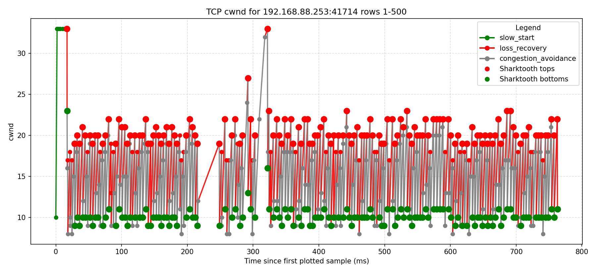

Interpretation: a large bucket can hide the mismatch for a short time, but it does not remove the queue pressure caused by `R_arrival > R_tbf`.

### Matching TBF Rate and Arrival Rate

When the TBF rate was raised to 1 Gbit/s, the simple formula worked much better.

| Setup | Run | Elapsed | Finding |
| --- | --- | ---: | --- |
| Reno-like, 1 Gbit/s TBF, 1 MB burst, 50000 B queue | `DB/1GB/phase1/1GB_47786_0` | 9.69 s | Baseline. |
| CWND 67, 1 Gbit/s TBF, 1 MB burst, 50000 B queue | `DB/1GB/phase1/1GB_50912_67` | 9.27 s | Theoretical CWND 67 matched empirical 66-67. |
| Reno-like, 1 Gbit/s TBF, 50000 B burst, 50000 B queue | `DB/1GB/phase1/1GB_38042_0` | 9.30 s | Baseline. |
| CWND 67, 1 Gbit/s TBF, 50000 B burst, 50000 B queue | `DB/1GB/phase1/1GB_42250_67` | 9.40 s | Empirical region still around 64-67. |

Plots:


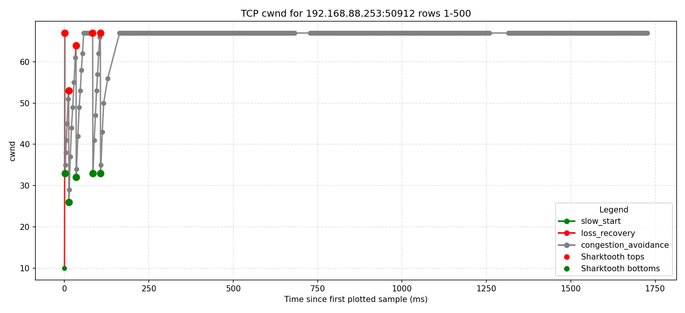


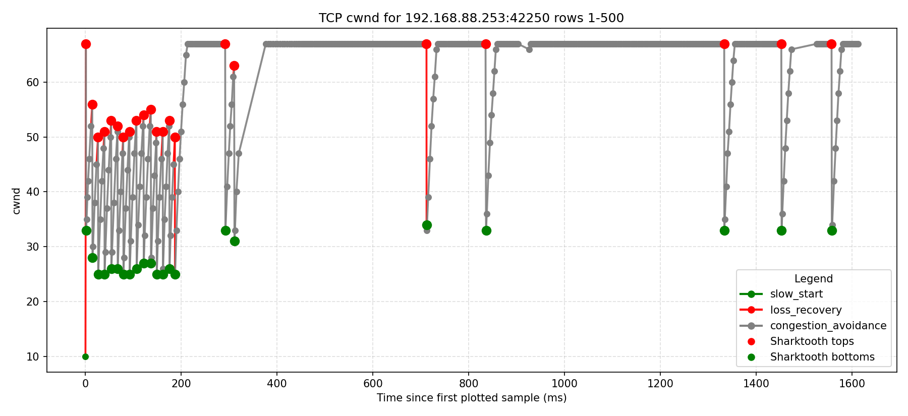

Interpretation: when `R_arrival ~= R_tbf`, `Q_tbf ~= 0`, so the original `BDP + Q_config - MSS` estimate becomes valid again.

## Phase 2: Revised Equation

For the 500 Mbit/s examples:

```text
R_tbf = 500 Mbit/s
RTT = 0.4 ms
BDP = 25000 B
R_arrival ~= 1000 Mbit/s
Q_tbf = 25000 * (1000 / 500 - 1) = 25000 B
```

With `Q_config = 50000 B`:

```text
Q_effective = 50000 - 25000 = 25000 B
cwnd ~= (25000 + 25000 - 1460) / 1460 = 33
```

With `Q_config = 25000 B`:

```text
Q_effective = 25000 - 25000 = 0 B
cwnd ~= (25000 + 0 - 1460) / 1460 = 16
```

When `Q_tbf > Q_config`, the TBF queue cannot absorb the full mismatch during one RTT. The model switches from "BDP plus effective queue" to a reduced usable BDP:

```text
usable_bdp = BDP * min(1, Q_config / Q_tbf)
cwnd = floor((usable_bdp - MSS) / MSS)
```

## Phase 3: Validation Tests

### Test 0: 200 Mbit/s, 25000 B Queue

Command:

```bash
./run.sh --cca my_cca --size-gib 1 --rtt-ms 0.4 --rate-mbit 200 --tbf-rate 200Mbit --tbf-burst 50000b --tbf-limit 25000b --cwnd 3
```

Result:

| Run | Elapsed | Finding |
| --- | ---: | --- |
| `DB/1GB/phase1/1GB_54264_3` | 45.14 s | Formula predicted CWND 3. |
| `DB/1GB/phase1/1GB_35434_0` | 45.06 s | Reno-like baseline had nearly the same elapsed time. |

Plot:


Interpretation: at low TBF rates, elapsed time alone is not enough to identify the optimal CWND because many CWNDs saturate the bottleneck. Loss behavior must also be considered.

### Test 1: 200 Mbit/s, 50000 B Queue

| Run | CWND | Elapsed | Loss-recovery signal | Finding |
| --- | ---: | ---: | ---: | --- |
| `DB/1GB/phase1/1GB_35170_12` | 12 | 45.11 s | 0 / 2248 | Formula prediction; already throughput-limited by TBF. |
| `DB/1GB/phase1/1GB_43370_15` | 15 | 45.05 s | 0 / 1903 | Same throughput region. |
| `DB/1GB/phase1/1GB_44342_30` | 30 | 44.98 s | 0 / 1249 | Still clean. |
| `DB/1GB/phase1/1GB_47504_32` | 32 | 44.96 s | 1 / 1213 | Safe upper region. |
| `DB/1GB/phase1/1GB_34780_33` | 33 | 44.96 s | 43 / 1276 | Borderline. |
| `DB/1GB/phase1/1GB_40442_35` | 35 | 44.99 s | 1429 / 4124 | Clearly too high. |

Plot:

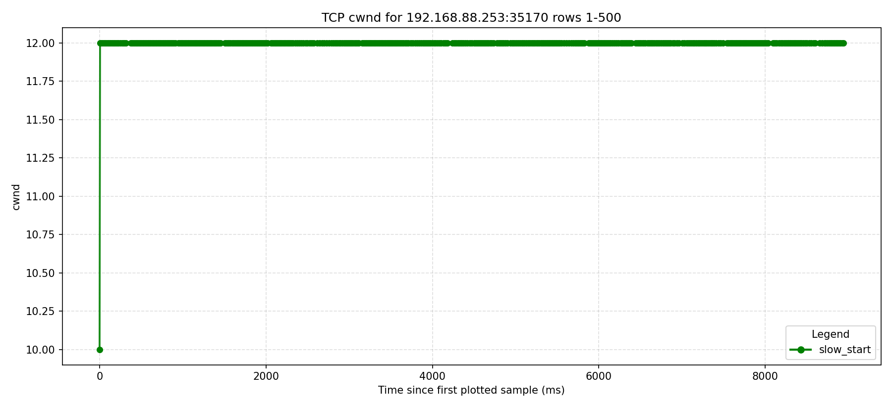

Interpretation: if optimizing elapsed time only, CWND 12 is enough. If optimizing "largest clean CWND before repeated loss recovery", the useful empirical region is closer to 30-32.

### Test 2: 750 Mbit/s, 50000 B Queue

The first assumption `R_arrival = 1000 Mbit/s` predicted CWND 57, but that was too high.

| Run | CWND | Elapsed | Loss-recovery signal | Finding |
| --- | ---: | ---: | ---: | --- |
| `DB/1GB/phase1/1GB_41662_57` | 57 | 12.07 s | 1054 / 4565 | Predicted by the too-low arrival estimate; too lossy. |
| `DB/1GB/phase1/1GB_47470_36` | 36 | 12.02 s | 184 / 3347 | Good candidate. |
| `DB/1GB/phase1/1GB_49228_37` | 37 | 12.07 s | 431 / 3557 | More loss. |
| `DB/1GB/phase1/1GB_39108_38` | 38 | 12.03 s | 199 / 3544 | Good candidate. |
| `DB/1GB/phase1/1GB_49024_39` | 39 | 12.07 s | 404 / 3537 | More loss. |
| `DB/1GB/phase1/1GB_55568_40` | 40 | 12.04 s | 494 / 3792 | More loss. |
| `DB/1GB/phase1/1GB_34342_42` | 42 | 12.19 s | 339 / 3736 | Still plausible but slower. |

Representative plot:


Reverse-estimating from CWND 36-42 gives `R_arrival ~= 1235-1420 Mbit/s`, not 1000 Mbit/s. This is why the revised final table uses an arrival range for this test.

### Test 3: 750 Mbit/s, 25000 B Queue

With `R_arrival ~= 1420 Mbit/s`, the formula predicts CWND 18.

| Run | CWND | Elapsed | Loss-recovery signal | Finding |
| --- | ---: | ---: | ---: | --- |
| `DB/1GB/phase1/1GB_47064_0` | 0 | 12.16 s | 3720 / 9924 | Reno-like baseline is lossy. |
| `DB/1GB/phase1/1GB_55592_18` | 18 | 12.02 s | 34 / 3128 | Best clean candidate. |
| `DB/1GB/phase1/1GB_42404_20` | 20 | 12.06 s | 1792 / 6341 | Too lossy. |
| `DB/1GB/phase1/1GB_55324_22` | 22 | 12.12 s | 3623 / 10188 | Too lossy. |
| `DB/1GB/phase1/1GB_32982_25` | 25 | 12.13 s | 3657 / 9990 | Too lossy. |

Plot:


### Test 4a: 750 Mbit/s, 12500 B Queue

The original note labels this calculation as `R_arrival = 1420 Mbit/s`, but the arithmetic uses the burst penalty for `R_arrival ~= 1235 Mbit/s`. Keeping `1420 Mbit/s` would predict a much smaller CWND.

| Run | CWND | Elapsed | Loss-recovery signal | Finding |
| --- | ---: | ---: | ---: | --- |
| `DB/1GB/phase1/1GB_38038_0` | 0 | 14.56 s | 6486 / 15521 | Reno-like baseline is slower and lossy. |
| `DB/1GB/phase1/1GB_33854_12` | 12 | 12.05 s | 1357 / 5865 | Throughput is good, but loss is still substantial. |

Plot:


Interpretation: the throughput result supports CWND 12, but the loss signal says this test should be repeated with more CWND points around 8-12.

### Test 4b: 750 Mbit/s, 6250 B Queue

This was also labeled "Test 4" in the original notes. I keep it separate as Test 4b because it uses a different queue size.

| Run | CWND | Elapsed | Loss-recovery signal | Finding |
| --- | ---: | ---: | ---: | --- |
| `DB/1GB/phase1/1GB_44108_0` | 0 | 64.73 s | 17066 / 36726 | Reno-like baseline collapses. |
| `DB/1GB/phase1/1GB_60834_5` | 5 | 21.78 s | 1 / 3694 | Clean but not fully TBF-rate-limited. |

Plot:


Interpretation: CWND 5 is clean and much better than Reno, but elapsed time is still above the ideal 750 Mbit/s transfer time. This is a good candidate for further local search around CWND 5-8.

### Test 5: 500 Mbit/s, 50000 B Queue

| Run | CWND | Elapsed | Loss-recovery signal | Finding |
| --- | ---: | ---: | ---: | --- |
| `DB/1GB/phase1/1GB_36664_0` | 0 | 18.02 s | 1345 / 5055 | Reno-like baseline is lossy. |
| `DB/1GB/phase1/1GB_49068_33` | 33 | 18.04 s | 13 / 2279 | Formula prediction works. |

Plot:

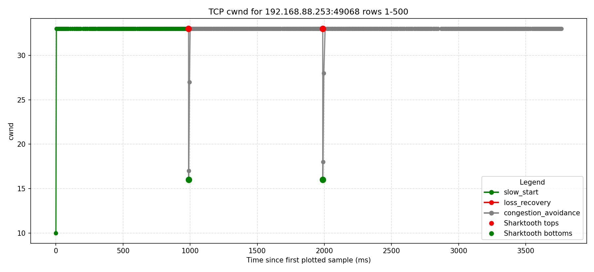

### Test 6: 500 Mbit/s, 25000 B Queue

| Run | CWND | Elapsed | Loss-recovery signal | Finding |
| --- | ---: | ---: | ---: | --- |
| `DB/1GB/phase1/1GB_37850_0` | 0 | 18.06 s | 4455 / 11370 | Reno-like baseline is lossy. |
| `DB/1GB/phase1/1GB_52256_16` | 16 | 18.05 s | 1 / 2864 | Formula prediction works. |

Plot:

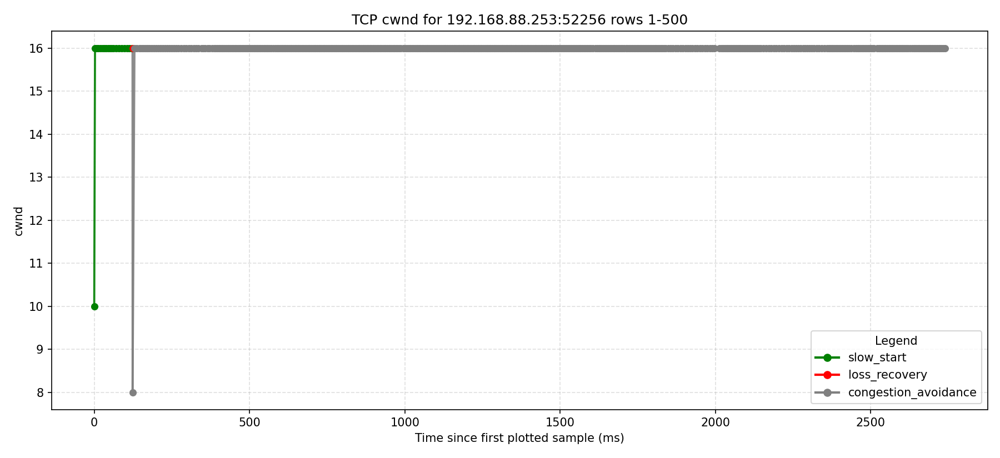

### Test 7: 500 Mbit/s, 12500 B Queue

| Run | CWND | Elapsed | Loss-recovery signal | Finding |
| --- | ---: | ---: | ---: | --- |
| `DB/1GB/phase1/1GB_48698_0` | 0 | 18.68 s | 12118 / 26779 | Reno-like baseline is lossy. |
| `DB/1GB/phase1/1GB_60200_7` | 7 | 18.08 s | 0 / 4132 | Formula prediction; clean. |
| `DB/1GB/phase1/1GB_38296_8` | 8 | 18.13 s | 0 / 3595 | Also clean. |
| `DB/1GB/phase1/1GB_43544_9` | 9 | 18.04 s | 5 / 3780 | Slightly faster, still mostly clean. |

Plot:

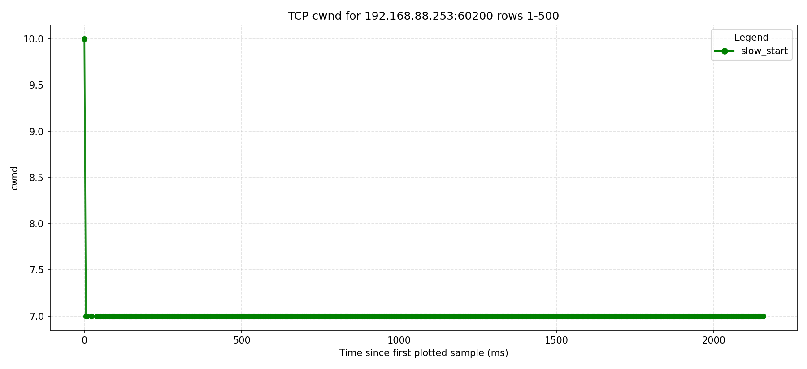

Interpretation: the formula gives the conservative clean point. Empirically, CWND 7-9 all perform similarly.

### Test 8: 500 Mbit/s, 6250 B Queue

| Run | CWND | Elapsed | Loss-recovery signal | Finding |
| --- | ---: | ---: | ---: | --- |
| `DB/1GB/phase1/1GB_52064_0` | 0 | 44.57 s | 18447 / 39334 | Reno-like baseline collapses. |
| `DB/1GB/phase1/1GB_34330_3` | 3 | 39.57 s | 1 / 3690 | Formula prediction, but too slow. |
| `DB/1GB/phase1/1GB_54646_4` | 4 | 22.97 s | 1 / 3739 | Better but still slow. |
| `DB/1GB/phase1/1GB_44654_7` | 7 | 18.29 s | 3 / 4061 | Empirical optimum among tested points. |

Plot:

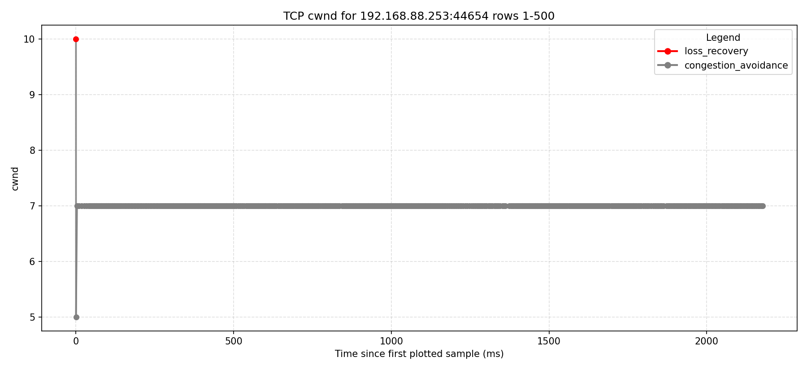

Interpretation: this is a mismatch case. The reduced-BDP formula underpredicts the best empirical CWND. Either the short-window `R_arrival` estimate is too high for this small queue, or the model is too pessimistic when the TBF queue is extremely small.

### Test 9: 250 Mbit/s, 50000 B Queue

| Run | CWND | Elapsed | Loss-recovery signal | Finding |
| --- | ---: | ---: | ---: | --- |
| `DB/1GB/phase1/1GB_51330_0` | 0 | 36.02 s | 1421 / 4329 | Reno-like baseline is lossy. |
| `DB/1GB/phase1/1GB_57344_33` | 33 | 36.00 s | 29 / 1401 | Empirical optimum. |
| `DB/1GB/phase1/1GB_37848_33` | 33 | 36.00 s | 23 / 1384 | Confirmation run. |

Plot:

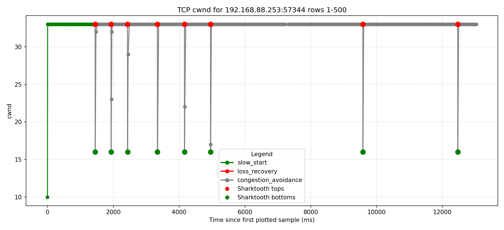

Reverse-estimating from CWND 33 gives `R_arrival ~= 507 Mbit/s`.

### Test 10: 250 Mbit/s, 25000 B Queue

| Run | CWND | Elapsed | Loss-recovery signal | Finding |
| --- | ---: | ---: | ---: | --- |
| `DB/1GB/phase1/1GB_42518_0` | 0 | 36.07 s | 4823 / 11905 | Reno-like baseline is lossy. |
| `DB/1GB/phase1/1GB_33412_16` | 16 | 36.01 s | 22 / 2226 | Formula value is 15.88, tested as 16. |

Plot:

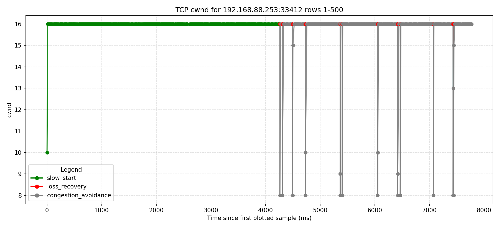

### Test 11: 250 Mbit/s, 12500 B Queue

| Run | CWND | Elapsed | Loss-recovery signal | Finding |
| --- | ---: | ---: | ---: | --- |
| `DB/1GB/phase1/1GB_51184_0` | 0 | 36.03 s | 13737 / 30440 | Reno-like baseline is lossy. |
| `DB/1GB/phase1/1GB_42770_7` | 7 | 36.08 s | 37 / 4616 | Formula prediction; clean. |
| `DB/1GB/phase1/1GB_45006_8` | 8 | 35.96 s | 2 / 3774 | Also clean and slightly faster. |
| `DB/1GB/phase1/1GB_51208_9` | 9 | 36.03 s | 8807 / 20828 | Too lossy. |

Plot:

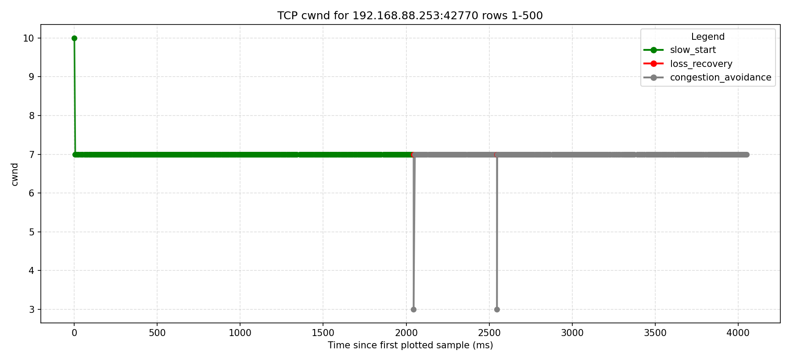

Interpretation: CWND 7-8 is the useful empirical region; CWND 9 is too lossy.

### Test 12: 250 Mbit/s, 6250 B Queue

| Run | CWND | Elapsed | Loss-recovery signal | Finding |
| --- | ---: | ---: | ---: | --- |
| `DB/1GB/phase1/1GB_50774_0` | 0 | 37.68 s | 41135 / 84049 | Reno-like baseline is lossy. |
| `DB/1GB/phase1/1GB_49192_3` | 3 | 39.34 s | 1 / 3667 | Formula prediction, but too slow. |
| `DB/1GB/phase1/1GB_36250_5` | 5 | 36.29 s | 12 / 3803 | Empirical optimum among tested points. |
| `DB/1GB/phase1/1GB_33640_6` | 6 | 36.44 s | 39685 / 81048 | Too lossy. |

Plot:

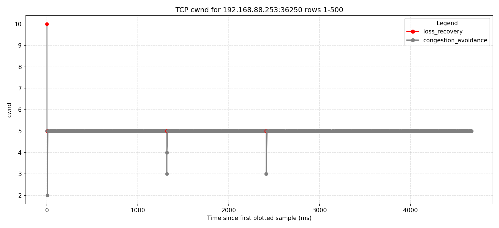

Interpretation: like Test 8, the very small queue case is not well predicted by the reduced-BDP model.

## Main Findings

1. When `R_arrival ~= R_tbf`, the simple `BDP + Q_config - MSS` estimate works.
2. When `R_arrival > R_tbf`, the model must subtract the burst penalty from the configured TBF queue.
3. When the burst penalty is larger than the configured queue size (`Q_tbf > Q_config`), the TBF cannot absorb one RTT of enqueue/drain mismatch. I handled this by setting `Q_effective = 0`, scaling the usable BDP as `usable_bdp = BDP * min(1, Q_config / Q_tbf)`, and then calculating `cwnd = floor((usable_bdp - MSS) / MSS)`.
4. Whole-transfer elapsed time is often insensitive to CWND once the TBF bottleneck is saturated. Loss-recovery rate is a better signal for choosing a clean CWND.
5. `R_arrival` is not a stable constant. Reverse-estimated values differ by TBF rate and queue size.
6. The reduced-BDP formula works for several small-queue cases, but it underpredicts CWND for the 500 Mbit/s / 6250 B and 250 Mbit/s / 6250 B tests.

## Recommended Next Step

Use RTT-windowed or percentile-based `R_arrival` from `r_arrival.txt` instead of whole-transfer averages. The useful value for the model is the short burst that fills TBF during approximately one base RTT, not the average throughput of the entire transfer.

## Final Table: Test 1 to Test 12

The original notes contain two headings named Test 4. They are separated here as Test 4a and Test 4b because they use different `Q_config` values.
Note that the case where R_tbf == 1000Mbit is not tested here as when R_tbf ~= R_arrival, the theoretical predicition of the initial equation `optimal cwnd = BDP + Q_config - MSS` works pretty well.

| Test | Token generation rate (`R_tbf`) | BDP | Burst penalty (`Q_tbf`) | R_arrival (estimate) | Q_config | Q_effective | Theoretical optimal cwnd | Empirical cwnd |
| --- | ---: | ---: | ---: | ---: | ---: | ---: | ---: | --- |
| Test 1 | 200 Mbit/s | 10000 B | 40000 B | 1000 Mbit/s | 50000 B | 10000 B | 12 | 30-32 safe, 33 borderline |
| Test 2 | 750 Mbit/s | 37500 B | 24250-33500 B | 1235-1420 Mbit/s | 50000 B | 16500-25750 B | 36-42 | 36-42, with 36/38 safest |
| Test 3 | 750 Mbit/s | 37500 B | 33500 B | 1420 Mbit/s | 25000 B | 0 B | 18 | 18 |
| Test 4a | 750 Mbit/s | 37500 B | 24250 B | 1235 Mbit/s | 12500 B | 0 B | 12 | 12, but loss remains high |
| Test 4b | 750 Mbit/s | 37500 B | 24250 B | 1235 Mbit/s | 6250 B | 0 B | 5 | 5 |
| Test 5 | 500 Mbit/s | 25000 B | 25000 B | 1000 Mbit/s | 50000 B | 25000 B | 33 | 33 |
| Test 6 | 500 Mbit/s | 25000 B | 25000 B | 1000 Mbit/s | 25000 B | 0 B | 16 | 16 |
| Test 7 | 500 Mbit/s | 25000 B | 25000 B | 1000 Mbit/s | 12500 B | 0 B | 7 | 7-9 |
| Test 8 | 500 Mbit/s | 25000 B | 25000 B | 1000 Mbit/s | 6250 B | 0 B | 3 | 7 |
| Test 9 | 250 Mbit/s | 12500 B | 12850 B | 507 Mbit/s | 50000 B | 37150 B | 33 | 33 |
| Test 10 | 250 Mbit/s | 12500 B | 12850 B | 507 Mbit/s | 25000 B | 12150 B | 16 | 16 |
| Test 11 | 250 Mbit/s | 12500 B | 12850 B | 507 Mbit/s | 12500 B | 0 B | 7 | 7-8 |
| Test 12 | 250 Mbit/s | 12500 B | 12850 B | 507 Mbit/s | 6250 B | 0 B | 3 | 5 |


250Mb queue_size 6250

client_server/DB/1GB/phase1/1GB_36452_0
client_server/DB/1GB/phase1/1GB_40138_6
client_server/DB/1GB/phase1/1GB_47382_3 (slow start end not detected )