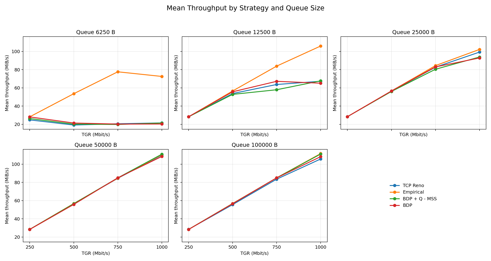
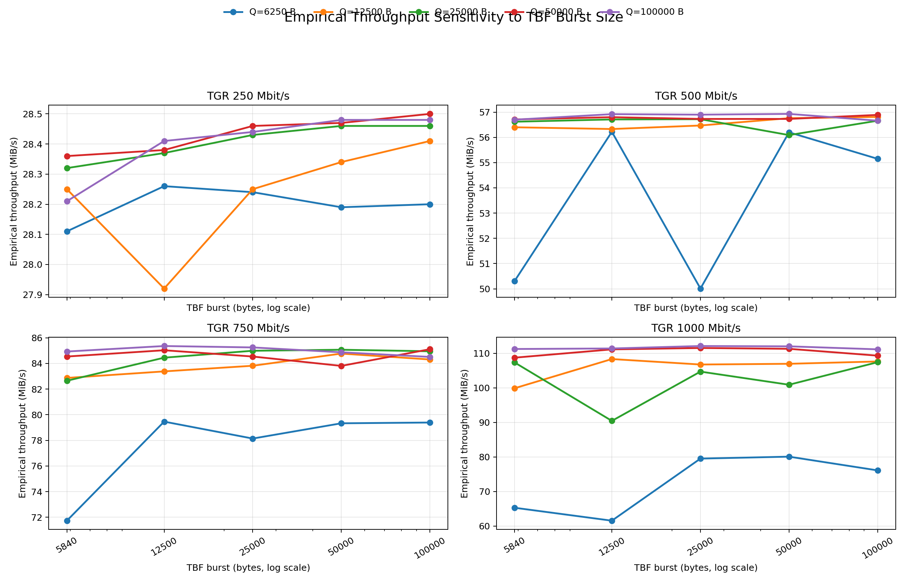
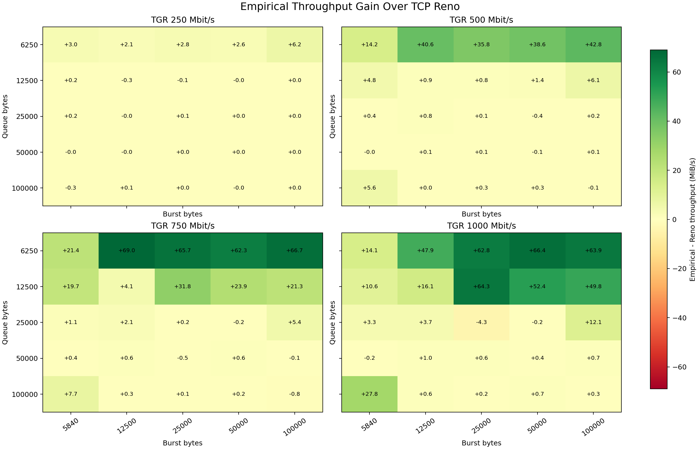
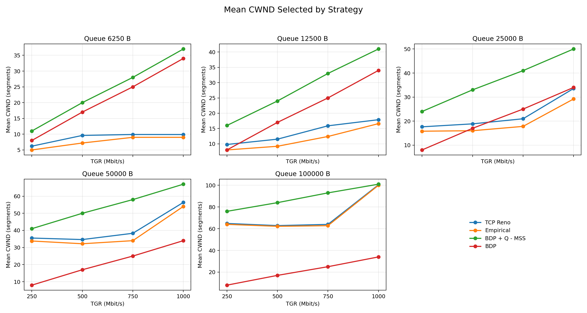
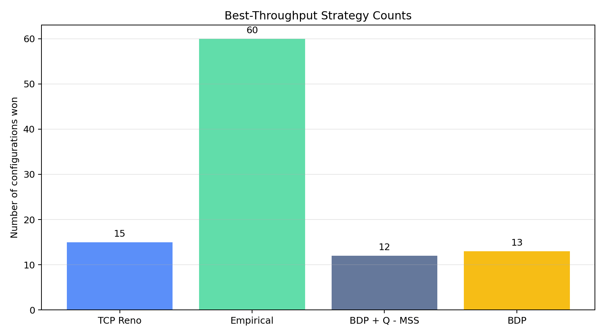

# Report 4 Analysis

This README is generated from `generated/all_results.csv` by `scripts/write_analysis_readme.py`.

## Generated Diagrams

- 
- 
- 
- 
- 

## Summary Metrics

- Parsed configurations: 100 queue/burst/rate points.
- Parsed strategy rows: 400.
- Mean throughput over all points: TCP Reno 55.92 MiB/s, Empirical 67.00 MiB/s, BDP + Q - MSS 55.75 MiB/s, BDP 56.13 MiB/s.
- Mean Empirical minus Reno throughput: 11.08 MiB/s.
- Mean Empirical minus BDP + Q - MSS throughput: 11.25 MiB/s.
- Mean Empirical minus BDP throughput: 10.87 MiB/s.

Best-throughput winner counts:

| Strategy | Wins |
|---|---:|
| TCP Reno | 15 |
| Empirical | 60 |
| BDP + Q - MSS | 12 |
| BDP | 13 |

Average Empirical minus Reno gain by queue:

| Queue bytes | Mean gain (MiB/s) |
|---:|---:|
| 6250 | 36.44 |
| 12500 | 15.39 |
| 25000 | 1.23 |
| 50000 | 0.18 |
| 100000 | 2.15 |

Average Empirical minus Reno gain by TGR:

| TGR (Mbit/s) | Mean gain (MiB/s) |
|---:|---:|
| 250 | 0.66 |
| 500 | 7.73 |
| 750 | 16.11 |
| 1000 | 19.80 |

Largest positive Empirical-over-Reno case:

- Queue 6250 B, burst 12500 B, TGR 750 Mbit/s: Empirical 79.46 MiB/s vs Reno 10.47 MiB/s (+68.99 MiB/s).

Largest negative Empirical-over-Reno case:

- Queue 25000 B, burst 25000 B, TGR 1000 Mbit/s: Empirical 104.69 MiB/s vs Reno 108.95 MiB/s (-4.26 MiB/s).

## Observations

1. Empirical CWND is the most reliable high-throughput choice in the small-queue cases. For 6250 B and 12500 B queues, Reno and the fixed BDP formulas often collapse at higher TGRs, while the empirical cap keeps throughput close to the bottleneck rate.

2. The simple `BDP + Q_size - MSS` CWND is too aggressive when the queue is small. It asks for CWND values like 37 at 1 Gbit/s with a 6250 B queue, but throughput stays around 12-16 MiB/s in many burst settings. This matches the earlier suspicion that configured queue size is not fully usable when enqueue bursts consume the TBF queue.

3. As queue size grows, the formulas become much less dangerous. At 50000 B and 100000 B queues, all strategies are often close to line rate, and `BDP + Q_size - MSS` sometimes wins outright.

4. Burst size matters most for small queues and high TGR. With a 6250 B queue, empirical throughput at 750-1000 Mbit/s improves sharply when moving away from the smallest burst setting, but Reno and the fixed formulas remain unstable. For larger queues, burst sensitivity is much flatter.

5. The empirical CWND generally tracks the Reno average-top CWND, but floors it or steps downward to satisfy the loss threshold. This is visible in the CWND plot: empirical values stay below Reno tops, while `BDP + Q_size - MSS` can be far above both for large queues.

6. The data mixes empirical-loss thresholds: the 6250 B and 12500 B sections use 0.20, while later sections use 0.05. Comparisons of empirical choices across those queue ranges should be interpreted with that threshold change in mind.

## Regeneration

Run all scripts from `client_server/report4`:

```bash
./scripts/generate_all.sh
```
